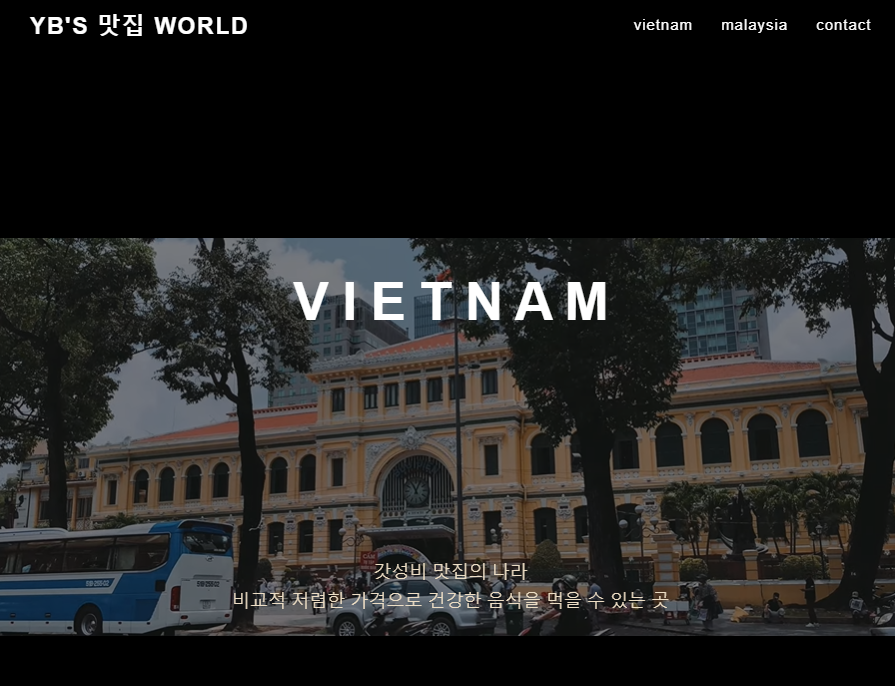
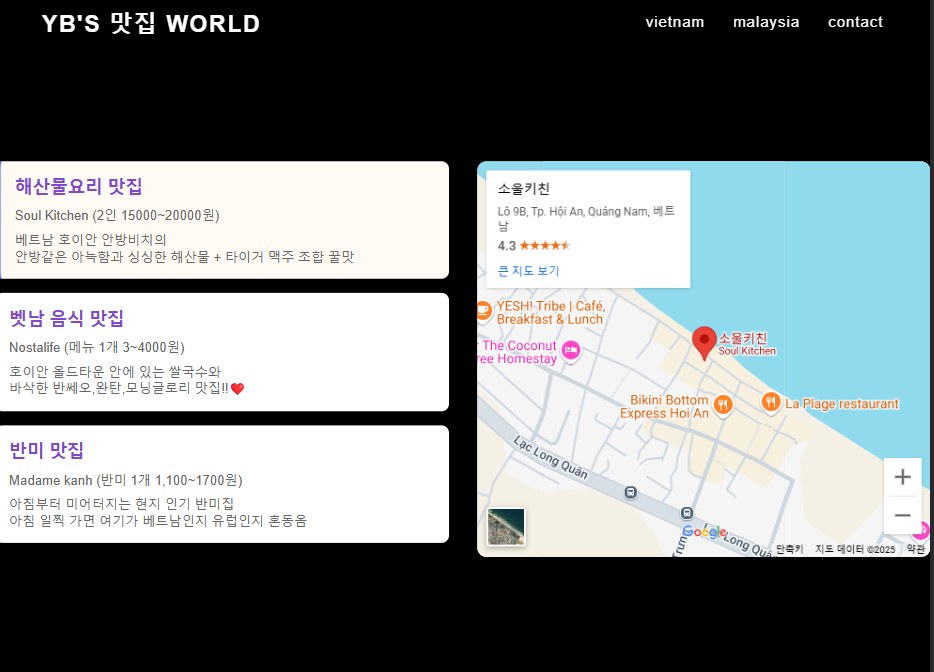

# 여행 vlog 컨셉 github Page 웹사이트
---
- 제작기간 : 2025.03.08~03.10 (개발2d 테스트1d)
- html,css,js
- 기능 : 조회성 브이로그 성격
        - youtube 영상 url, google map url 로 가져옴.
- 간단설명 : 제가 여행하면서 추천하고 싶은 맛집을 구글맵으로 가져와서 조회할 수 있습니다.
- 노션 : https://cyeongb.notion.site/YB-s-Travel-1b2aa4605a0b80f7bd3cfcbf5f0d9cb1?pvs=4
- 깃헙 페이지 : cyeongb.github.io/project2/
----

